## 🔧 프로젝트 환경 ##

<ul>
  <li>Java version: jdk-11.0.18</li>
  <li>Gradle version: 8.0</li>
  <li>lombok version: 1.18.28</li>
</ul>

## 📂 Project Structure ##

```bash
📦src
 ┣ 📂main
 ┃ ┣ 📂generated
 ┃ ┣ 📂java
 ┃ ┃ ┗ 📂kr
 ┃ ┃ ┃ ┗ 📂co
 ┃ ┃ ┃ ┃ ┗ 📂_29cm
 ┃ ┃ ┃ ┃ ┃ ┗ 📂homework
 ┃ ┃ ┃ ┃ ┃ ┃ ┣ 📂controller
 ┃ ┃ ┃ ┃ ┃ ┃ ┣ 📂data
 ┃ ┃ ┃ ┃ ┃ ┃ ┃ ┗ 📂repository
 ┃ ┃ ┃ ┃ ┃ ┃ ┃ ┃ ┗ 📂products
 ┃ ┃ ┃ ┃ ┃ ┃ ┃ ┃ ┃ ┗ 📜ProductRepository.java
 ┃ ┃ ┃ ┃ ┃ ┃ ┣ 📂domain
 ┃ ┃ ┃ ┃ ┃ ┃ ┃ ┗ 📂products
 ┃ ┃ ┃ ┃ ┃ ┃ ┃ ┃ ┣ 📂dto
 ┃ ┃ ┃ ┃ ┃ ┃ ┃ ┃ ┗ 📜Product.java
 ┃ ┃ ┃ ┃ ┃ ┃ ┣ 📂service
 ┃ ┃ ┃ ┃ ┃ ┃ ┃ ┗ 📂products
 ┃ ┃ ┃ ┃ ┃ ┃ ┃ ┃ ┗ 📜ProductSale.java
 ┃ ┃ ┃ ┃ ┃ ┃ ┗ 📜Main.java
 ┃ ┗ 📂resources
 ┗ 📂test
 ┃ ┣ 📂java
 ┃ ┃ ┗ 📂kr
 ┃ ┃ ┃ ┗ 📂co
 ┃ ┃ ┃ ┃ ┗ 📂_29cm
 ┃ ┃ ┃ ┃ ┃ ┗ 📂homework
 ┃ ┃ ┃ ┃ ┃ ┃ ┗ 📜MultiThreadRequestTest.java
 ┃ ┗ 📂resources
```


### Components ###

클린 아키텍처는 꼭 원이 4개가 아니어도 되며 의존 규칙은 바깥에서 안으로 흘러야 한다.

Request 👉 Controller 👉 UseCase 👉 Entity(Repository)

현재 프로젝트에 요구사항을 보았을 때 높은 수준의 추상화는 구조가 더 복잡해질 것이라 판단<br/>
또한, RDBMS 를 사용하지 않고 CSV 파일에 데이터를 가져와 개발하여 만들어질 구조는 아래와 같다.

Request 👉 Service 👉 Entity(Repository)

이후에 확장성을 위한 directory 구조

- data
    - repository
        - products
            - 상품 주문에 사용할 데이터베이스 요청 객체 구성
- domain
    - products
        - 상품 정보 도메인 객체
            - dto
                - 계층 간 데이터 전송을 위한 객체
- service
    - products
        - 상품 주문 비즈니스 로직
- controller (이 프로젝트에서는 main() 함수로 대체)
    - 요청을 받아 방향을 정하는 첫 관문

## 📌 Stack ##

 

## 💻 실행 화면 ##

### 초기 상품 메뉴 ###


### 2개 상품 주문 ###

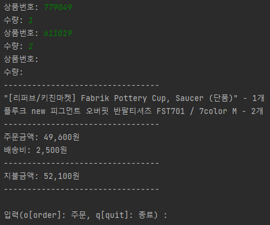

### 상품 결제 후 메뉴 ###

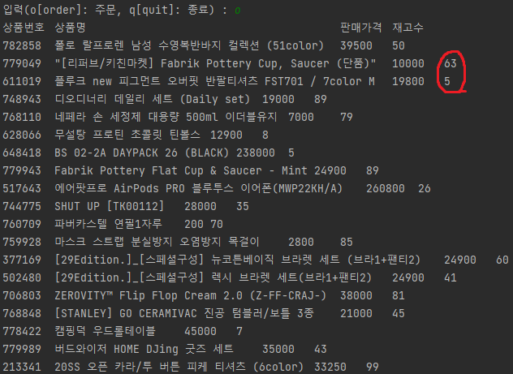

### 1개 상품 주문 ###

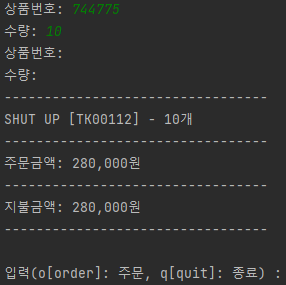

### 상품 결제 후 메뉴 ###

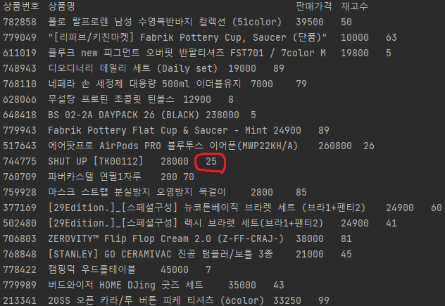

### 상품 재고 부족 ###

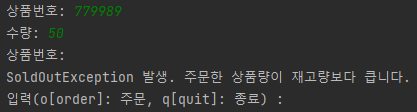

### 상품 주문 종료 ###

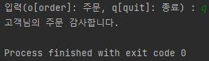

## 🔎 Test ##

### 테스트 실행 ###

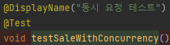

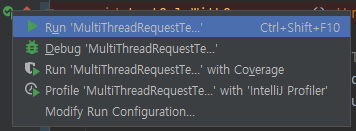

### 초기 사용자 및 멀티 쓰레드 세팅 ###

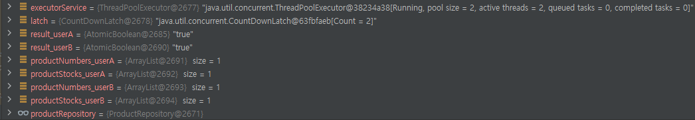

### 현재 실행되고 있는 쓰레드 ###

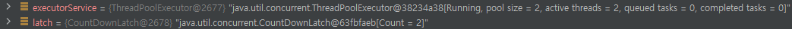

### 사용자 A 상품 주문 ###

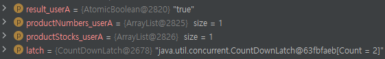

### 사용자 B 상품 주문 ###

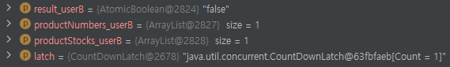

### 쓰레드 작업 완료 ###

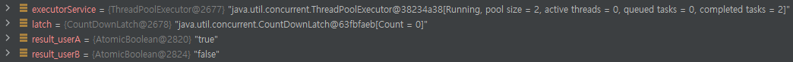

### 사용자 A 와 사용자 B 멀티 쓰레드 요청 처리 테스트 성공화면 ###

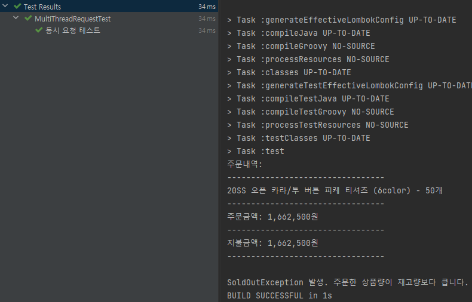

## 📉 테스트 쓰레드 WorkFlow

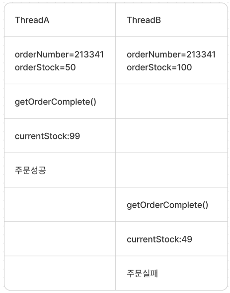

## ✍ 쓰레드 처리의 Point

<p>
  <h4>WorkFlow 에서 보여지는 흐름과 같이 사용자가 주문에 대한 결제를 진행할 때 다른 쓰레드에서는 주문 결제를 기다리고 있어야한다.
  그렇지 않으면 상품번호:213341 의 재고가 부족함에도 주문 결제가 진행되어 사용자는 없는 상품을 주문을 하게된다.</h4>
</p>
<p>
  <h4>여기서 고민해야되는 Point 가 DB Transaction Level 과 method Level 2가지이다.
  해결방법은 결제가 발생할 때 Lock 을 걸어주는 것이다.
  </h4>
  <h4>이 프로젝트에서는 데이터베이스를 사용하지 않았기 때문에 method Level 에서 Lock 을 걸어주었다. 
  </h4>
</p>

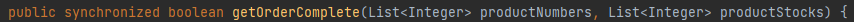

<p>
  <h4>쓰레드가 getOrderComplete() 작업을 수행할 때 다른 쓰레드가 접근 하지 못하게 하고 작업이 마무리 된 후에 다른 쓰레드가 접근할 수 있다. 
  </h4>
</p>

## ⏱ 시간 복잡도

<p>
  <h4>시간 복잡도는 함수의 실행 시간을 표현하는 것<br/>
  주로 점근적 분석을 통해 실행 시간을 단순하게 표현하며<br/>
  이 때 점근적 표기법으로 표현함
  </h4>
</p>


main 에서 실행되는 method 가 2개 있다.<br/>
main 의 선언된 method 2개를 실행하면 끝나기 때문에 빅오 표기법으로 표현하면 ```O(1)``` 상수시간의 시간복잡도를 가진다.
하지만, 실행되는 method 의 내부 로직을 확인해 보아야 한다.

productRepository.getData() 로직을 확인해보면<br/>

```java
while((line=file.readLine())!=null){
    /* Service Logic */
}
```

while 반복문 1개가 돌고있다. 이 반복문은 CSV 파일의 존재하는 행의 개수만큼 반복하고 종료한다.
현재는 20개 행이 존재하기 때문에 20번 반복하고 종료될 것이다.
하지만, 상품 수는 증가 할 수 있는 성격을 가지기 때문에 찾으려는 상품 수 만큼 탐색한다고 할 수 있어 ```O(N)``` 시간 복잡도를 가진다.

이제 productSale.run() 로직을 확인해보자
```java
while (true){ // 종료 입력 전까지 '주문'을 반복적으로 입력 받는 반복문
    /* Service Logic */
    while (true){ // '상품번호', '수량'을 반복적으로 입력 받는 반복문
        /* Service Logic */
    }
}
```

while 반복문 2개가 돌고있다.<br/>
첫 번째 반복문의 역할은 사용자가 '주문' or '종료' 를 선택하는 반복문이다.<br/>
두 번째 반복문의 역할은 사용자가 '주문' 선택시 주문할 '상품번호' and '수량' 을 반복적으로 입력받는 반복문이다.<br/>
<p>사용자의 입력이 1번으로 끝날 수도 있고 100번으로 끝날 수도 있어 예측이 불가하지만 결국에는 사용자가 입력하는 횟수만큼 반복할 것이다.</p>

여기서 반복문 내부의 존재하는 method 들도 확인해보자

첫 번째 반복문에서 동작하는 method 가 2개 존재한다.
- productRepository.getCurrentProductInfo()
- productRepository.getOrderComplete(productNumbers, productStocks)
```java
// getCurrentProductInfo()
productMap.forEach((k, v) ->
    /* Service Logic */
        )

// getOrderComplete(productNumbers, productStocks)
for (int i = 0; i < productNumbers.size(); i++) {
    /* Service Logic */
        }
```
getCurrentProductInfo() 는 저장된 상품 정보를 하나씩 출력하고 있다.<br/>
현재는 19개의 상품정보를 가지고 있어 ```O(19)``` 상수 시간만 반복하지만 이 경우도 상품 데이터가 증가할 수 있는 성격을 띄기 때문에 존재하는 상품 수 만큼 탐색한다고 할 수 있어 ```O(N)``` 시간복잡도를 가진다.<br/>

getOrderComplete(productNumbers, productStocks) 는 사용자가 주문한 만큼 반복이 진행된다.<br/>
사용자 주문이 1번일 수 도 있고 100번 일 수도 있기 때문에 결국 사용자 주문만큼 반복하게되 ```O(N)``` 시간 복잡도를 가진다.

두 번째 반복문에서 동작하는 method 도 2개 존재한다.
- productRepository.getStockCheck(orderNumber, orderStock)
- productRepository.getProductCheck(orderNumber)
```java
// getStockCheck(orderNumber, orderStock)
if (product != null) {
    /* Service Logic */
    if (currentStock < orderStock) {
        /* Service Logic */
        }
}

// getProductCheck(orderNumber)
if (productExist != null) {
    /* Service Logic */
}
```
getStockCheck(orderNumber, orderStock) 는 현재 존재하는 재고 수와 주문한 재고 수를 확인하는 기능이다.
이중 조건문을 사용하지만 조건문은 ```O(1)``` 상수 시간의 시간복잡도를 가진다.

getProductCheck(orderNumber) 는 사용자가 주문한 상품이 존재하는 상품인지 확인하는 기능이다.
조건문 하나를 사용하고 있어 ```O(1)``` 상수 시간의 시간복잡도를 가진다.

결론적으로, 최고차항만을 남기는 점근적 표기법인 빅오(Big-O) 표기법으로 표현한다면<br/>
두 번째 반복문에서 동작하는 함수는 실행시간에서 제외할 수 있고,<br/>
첫 번째 반복문에서는 반복문이 1개 중첩되어 사용되는걸 확인할 수 있기 때문에
이 프로그램은 ```O(N^2)``` 시간복잡도를 가진다고 할 수 있다.<br/>